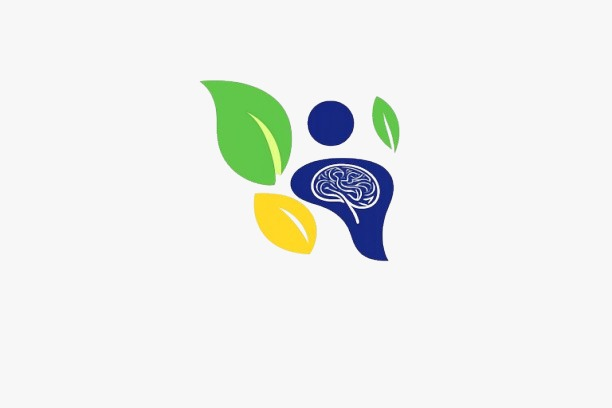

<p align="center">
  
</p>

<h1 align="center">Healix — AI-Powered Health & Wellness Platform</h1>

<p align="center">
  <b>Your AI Health Advisor</b> · Track nutrition, fitness, sleep & more — with AI-generated plans and real-time doctor consultations.
</p>

<p align="center">
  
  
  
  
  
  
  
</p>

---

## 📖 Table of Contents

- [Overview](#-overview)
- [Key Features](#-key-features)
- [Architecture](#-architecture)
- [Tech Stack](#-tech-stack)
- [Project Structure](#-project-structure)
- [Getting Started](#-getting-started)
  - [Prerequisites](#prerequisites)
  - [Backend Setup](#1-backend-setup)
  - [Frontend Web Setup](#2-frontend-web-setup)
  - [Desktop App Setup](#3-desktop-app-electron)
  - [Mobile App Setup](#4-mobile-app-flutter)
- [API Reference](#-api-reference)
- [Database Schema](#-database-schema)
- [Documentation](#-documentation)
- [Screenshots](#-screenshots)
- [Contributing](#-contributing)
- [License](#-license)

---

## 🌟 Overview

**Healix** is a comprehensive, cross-platform health and wellness ecosystem that empowers users to take control of their health journey. The platform combines AI-powered assistance (Google Gemini) with real-time doctor consultations to deliver personalized nutrition, fitness, and wellness guidance.

The system supports three distinct roles — **Member**, **Doctor**, and **Admin** — each with a dedicated portal tailored to their workflow.

---

## 🚀 Key Features

### 🤖 AI Health Assistant
- **Google Gemini-powered chatbot** with function-calling capabilities
- Auto-generates personalized **meal plans** and **exercise plans** based on user profile, goals, and medical conditions
- Can **recommend and forward** users to available doctors
- Daily token quota system (50 tokens/day, auto-reset at midnight)

### 🥗 Nutrition & Meal Planning
- **Food logging** with search across a comprehensive nutrition database
- **Calorie & macro tracking** (protein, carbs, fats) with visual charts
- **Personalized meal plans** created by doctors or AI
- **Recipe library** managed by platform admins
- **Water intake tracking** with daily goals

### 🏋️ Fitness & Activity
- **Exercise plans** with structured routines
- **Exercise library** with categorized workouts
- **Step counting** (mobile pedometer integration)
- **Exercise logging** with duration and calorie tracking

### 📊 Health Tracking
- **Weight & BMI tracking** with progress visualization
- **Sleep quality & stress monitoring**
- **Daily health summary dashboard** with donut, bar, and line charts
- **Progress reports** and trend analysis

### 👨‍⚕️ Doctor-Patient System
- **Doctor request workflow** — users request, doctors review and accept/reject
- **Real-time chat** between doctors and patients via Socket.IO
- **Patient case view** — doctors see full medical history, conditions, and goals
- **Personalized target setting** — doctors adjust macro/calorie targets per patient
- **Medical records management** — upload and manage health documents (images/PDFs)

### 👥 Community & Wellness
- **Habit tracking** — create, log, and monitor daily habits
- **Intermittent fasting tracker** — start/stop fasting sessions with history
- **Community posts** — share, like, and engage with the community
- **Challenges** — join and participate in health challenges

### 🔔 Smart Notifications
- **Real-time notifications** via Socket.IO
- **Cron-based reminders**: daily food logging, weekly weigh-in, subscription expiry alerts
- **In-app notification center** with read/unread status

### 💳 Subscription System
- **Three tiers**: Free, Pro, Doctor (includes doctor assignment)
- **Admin-managed approval workflow** with notes
- **Auto-expiry** with advance warnings (3-day and last-day)

---

## 🏗️ Architecture

```
┌─────────────────────────────────────────────────────────┐
│                      CLIENTS                            │
│                                                         │
│  ┌──────────┐   ┌──────────────┐   ┌──────────────┐    │
│  │  Web App  │   │ Desktop App  │   │  Mobile App  │    │
│  │ (HTML/JS) │   │  (Electron)  │   │  (Flutter)   │    │
│  └────┬─────┘   └──────┬───────┘   └──────┬───────┘    │
│       │                │                   │            │
└───────┼────────────────┼───────────────────┼────────────┘
        │                │                   │
        └────────────────┼───────────────────┘
                         │
              ┌──────────▼──────────┐
              │   REST API + WS     │
              │  (Express + Socket) │
              │     Port 5000       │
              └──────────┬──────────┘
                         │
          ┌──────────────┼──────────────┐
          │              │              │
  ┌───────▼──────┐ ┌────▼─────┐ ┌──────▼──────┐
  │    MySQL     │ │  Gemini  │ │   File      │
  │   Database   │ │   AI API │ │   Storage   │
  │  (diet_db)   │ │          │ │  (/uploads) │
  └──────────────┘ └──────────┘ └─────────────┘
```

The backend follows an **MVC architecture** with clearly separated routes, controllers, and models. Real-time communication is handled via Socket.IO for doctor-patient chat and notification delivery.

---

## 🛠️ Tech Stack

| Layer | Technology |
|-------|-----------|
| **Backend** | Node.js, Express.js, MySQL (mysql2), Socket.IO, JWT, bcrypt |
| **AI** | Google Gemini API (`@google/genai`), Anthropic SDK |
| **Frontend Web** | Vanilla HTML5, CSS3, JavaScript (ES6+), Canvas charts |
| **Desktop** | Electron v41 |
| **Mobile** | Flutter (Dart SDK ≥ 3.4), fl_chart, pedometer, local_auth |
| **Real-time** | Socket.IO (server + client) |
| **Task Scheduling** | node-cron |
| **File Uploads** | Multer |
| **Notifications** | Firebase Admin SDK |

---

## 📁 Project Structure

```
Healix/
├── diet-backend/                 # Node.js REST API server
│   ├── src/
│   │   ├── server.js             # Entry point — HTTP + Socket.IO server
│   │   ├── app.js                # Express app configuration
│   │   ├── config/               # Database & auth configuration
│   │   ├── routes/               # 16 route modules
│   │   ├── controllers/          # 16 controller modules
│   │   ├── models/               # 11 data models (raw SQL)
│   │   ├── middleware/           # Auth middleware (JWT)
│   │   ├── seed/                 # Database seed scripts
│   │   └── cron/                 # Scheduled tasks
│   ├── package.json
│   └── .env                      # Environment variables (not tracked)
│
├── healix_frontend/              # Web client (static SPA)
│   ├── index.html                # Portal chooser (Member/Doctor/Admin)
│   ├── login.html                # Member login
│   ├── register.html             # User registration
│   ├── app.html                  # Member dashboard (main SPA)
│   ├── doctor.html               # Doctor portal
│   ├── admin.html                # Admin portal
│   ├── css/                      # Stylesheets
│   └── js/
│       ├── api.js                # Centralized API service layer
│       ├── auth.js               # Authentication handlers
│       ├── app.js                # Main SPA controller
│       ├── doctor-portal.js      # Doctor portal logic
│       ├── admin-portal.js       # Admin portal logic
│       └── pages/                # 20 individual page modules
│
├── healix_front_desktop/         # Electron desktop wrapper
│   ├── main.js                   # Electron main process
│   └── package.json
│
├── healix_mobile/                # Flutter mobile app
│   └── healix_app-master/
│       ├── lib/                  # Dart source code
│       │   ├── features/         # Feature modules (auth, dashboard, etc.)
│       │   └── core/             # Services, routing, state, theme
│       ├── pubspec.yaml          # Flutter dependencies
│       └── assets/               # Images and assets
│
├── docs/                         # Project documentation
│   └── PROJECT_DIAGRAMS.md       # UML, ERD, sequence diagrams (Mermaid)
│
├── scripts/                      # Utility scripts
│   └── generate-diagram-pdfs.js  # Generate PDF diagrams
│
├── logo.jpeg                     # Healix branding logo
└── README.md                     # This file
```

---

## 🚀 Getting Started

### Prerequisites

| Tool | Version | Purpose |
|------|---------|---------|
| **Node.js** | ≥ 18.x | Backend server |
| **MySQL** | ≥ 8.0 | Database |
| **Flutter** | ≥ 3.4 | Mobile app |
| **Git** | Latest | Version control |

### 1. Backend Setup

```bash
# Navigate to the backend directory
cd diet-backend

# Install dependencies
npm install

# Create environment file
cp .env.example .env
# Edit .env with your configuration:
#   DB_HOST=localhost
#   DB_USER=root
#   DB_PASSWORD=your_password
#   DB_NAME=diet_db
#   DB_PORT=3306
#   JWT_SECRET=your_jwt_secret
#   GEMINI_API_KEY=your_gemini_api_key
#   PORT=5000

# Set up the MySQL database
mysql -u root -p -e "CREATE DATABASE IF NOT EXISTS diet_db;"

# Seed the database with initial data
npm run seed:foods
npm run seed:conditions
npm run seed:rules
npm run seed:plans

# Start the development server
npm run dev
```

The backend will be running at `http://localhost:5000`

### 2. Frontend Web Setup

The frontend is served statically by the backend. Once the backend is running, access the web client at:

```
http://localhost:5000/healix
```

Alternatively, for standalone development:

```bash
cd healix_frontend

# If you have a simple HTTP server (e.g., live-server)
npx live-server --port=3000
```

### 3. Desktop App (Electron)

```bash
cd healix_front_desktop

# Install dependencies
npm install

# Run the desktop app
npm start
```

### 4. Mobile App (Flutter)

```bash
cd healix_mobile/healix_app-master

# Get Flutter dependencies
flutter pub get

# Run on connected device or emulator
flutter run

# Build for Android
flutter build apk

# Build for iOS
flutter build ios
```

> **Note:** Update the API base URL in the mobile app's configuration to point to your backend server address.

---

## 📡 API Reference

The backend exposes a RESTful API at `http://localhost:5000/api`. All authenticated endpoints require a JWT token in the `Authorization: Bearer <token>` header.

### Authentication
| Method | Endpoint | Description |
|--------|----------|-------------|
| `POST` | `/api/auth/register/user` | Register a new user |
| `POST` | `/api/auth/login` | Login (user/doctor/admin) |
| `GET` | `/api/auth/me` | Get current user profile |

### User Management
| Method | Endpoint | Description |
|--------|----------|-------------|
| `GET` | `/api/users/me` | Get user profile |
| `PUT` | `/api/users/me` | Update user profile |
| `GET` | `/api/users/conditions` | Get user conditions |
| `POST` | `/api/users/subscribe` | Subscribe to a plan |
| `POST` | `/api/users/request-doctor` | Request doctor assignment |

### Health Tracking
| Method | Endpoint | Description |
|--------|----------|-------------|
| `GET` | `/api/tracking/summary` | Get daily health summary |
| `GET/POST/DELETE` | `/api/tracking/food-log` | Manage food logs |
| `GET/POST` | `/api/tracking/weight` | Weight tracking |
| `GET/POST` | `/api/tracking/water` | Water intake tracking |
| `GET/POST` | `/api/tracking/sleep` | Sleep logging |
| `GET/POST` | `/api/tracking/steps` | Step counting |
| `GET/POST` | `/api/tracking/exercise` | Exercise logging |

### Meal & Exercise Plans
| Method | Endpoint | Description |
|--------|----------|-------------|
| `GET` | `/api/plans/my-plans` | Get user's plans |
| `GET` | `/api/plans/:id` | Get plan details |
| `POST` | `/api/plans/users/:username` | Create plan for user |

### AI Agent
| Method | Endpoint | Description |
|--------|----------|-------------|
| `POST` | `/api/agent/chat` | Chat with AI assistant |
| `GET` | `/api/agent/history` | Get chat history |
| `POST` | `/api/agent/generate-meal-plan` | AI-generate meal plan |
| `POST` | `/api/agent/generate-exercise-plan` | AI-generate exercise plan |
| `GET` | `/api/agent/tokens` | Check remaining AI tokens |

### Doctor Portal
| Method | Endpoint | Description |
|--------|----------|-------------|
| `GET` | `/api/doctors/list` | List available doctors |
| `GET` | `/api/doctors/users/:uname/case` | View patient case |
| `POST` | `/api/doctors/respond-request` | Accept/reject patient request |
| `PUT` | `/api/doctors/users/:uname/targets` | Update patient targets |

### Real-time Communication
| Method | Endpoint | Description |
|--------|----------|-------------|
| `GET` | `/api/messaging/history/:partner` | Get chat history |
| `GET` | `/api/messaging/notifications` | Get notifications |

<details>
<summary><b>View all endpoints →</b></summary>

### Community
| Method | Endpoint | Description |
|--------|----------|-------------|
| `CRUD` | `/api/community/habits` | Habit management |
| `POST` | `/api/community/fasting/start` | Start fasting session |
| `POST` | `/api/community/fasting/end` | End fasting session |
| `CRUD` | `/api/community/posts` | Community posts |
| `CRUD` | `/api/community/challenges` | Health challenges |

### Content Library
| Method | Endpoint | Description |
|--------|----------|-------------|
| `GET` | `/api/content/recipes` | Browse recipes |
| `GET` | `/api/content/exercises` | Browse exercises |
| `GET` | `/api/foods?search=` | Search food database |

### Medical Records
| Method | Endpoint | Description |
|--------|----------|-------------|
| `GET` | `/api/medical/my-history` | Get medical history |
| `GET/POST/DELETE` | `/api/medical/records` | Manage medical records |

### Admin & Subscriptions
| Method | Endpoint | Description |
|--------|----------|-------------|
| `GET` | `/api/admin/stats` | Platform statistics |
| `GET` | `/api/admin/users` | List all users |
| `PUT` | `/api/admin/users/:uname/subscription` | Update user subscription |
| `POST` | `/api/subscriptions/request` | Request subscription upgrade |
| `POST` | `/api/subscriptions/:id/review` | Review subscription request |

</details>

---

## 🗄️ Database Schema

The MySQL database (`diet_db`) contains **39 tables** organized across the following domains:

| Domain | Tables |
|--------|--------|
| **Accounts** | `user_account`, `doctor`, `admin_account` |
| **Doctor-Patient** | `user_doctor_consultation`, `doctor_patient_chat` |
| **Health Profile** | `user_requirement`, `user_medical_history`, `user_medical_record`, `conditions`, `user_conditions`, `medical_condition`, `condition_diet_rule` |
| **Nutrition** | `food`, `nutrition_facts`, `food_medical`, `mealtime`, `recipes` |
| **Plans** | `diet_plan`, `plan_meal`, `plan_meal_item`, `exercises`, `exercise_plans`, `plan_exercises` |
| **Tracking** | `food_log`, `weight_log`, `water_log`, `sleep_log`, `step_log`, `exercise_log` |
| **Community** | `habit`, `habit_log`, `fasting_session`, `community_post`, `challenge`, `challenge_participant` |
| **AI** | `ai_chat_history`, `user_ai_tokens` |
| **Platform** | `notification`, `subscription_requests` |

> For full ERD and relationship diagrams, see [`docs/PROJECT_DIAGRAMS.md`](docs/PROJECT_DIAGRAMS.md)

---

## 📚 Documentation

Detailed project documentation is available in the [`docs/`](docs/) directory:

- **[`PROJECT_DIAGRAMS.md`](docs/PROJECT_DIAGRAMS.md)** — Comprehensive technical documentation including:
  - UML Class Diagrams (module-level architecture)
  - Entity-Relationship Diagram (39 tables)
  - Detailed database schema with column specifications
  - Sequence diagrams (login, doctor workflow, AI agent, messaging)
  - Flowcharts (request handling, subscription flow, AI agent flow, daily tracking)

Generate PDF versions of the diagrams:
```bash
node scripts/generate-diagram-pdfs.js
```

---

## 🖼️ Screenshots

> Screenshots will be added here in a future update.

---

## 🤝 Contributing

1. **Fork** the repository
2. **Create** a feature branch (`git checkout -b feature/amazing-feature`)
3. **Commit** your changes (`git commit -m 'Add amazing feature'`)
4. **Push** to the branch (`git push origin feature/amazing-feature`)
5. **Open** a Pull Request

---

## 📄 License

This project is open source and available under the [MIT License](LICENSE).

---

<p align="center">
  Made with ❤️ by the Healix Team
</p>
