# Healix Project Diagrams

This document maps the current Healix codebase from the source under:

- `diet-backend`: Node.js, Express, Socket.IO, MySQL
- `healix_frontend`: browser client
- `healix_front_desktop`: Electron wrapper around the browser client
- `healix_mobile/healix_app-master`: Flutter mobile client

The backend does not include migration files or `CREATE TABLE` statements, so the ERD and schema below are inferred from model, controller, route, seed, and server SQL queries.

## Important Schema Notes

- `notification.user_username`, `doctor_patient_chat.sender_username`, and `doctor_patient_chat.receiver_username` are polymorphic username fields. The code stores user, doctor, and admin usernames in these fields depending on context.
- The code references both `conditions` plus `user_conditions`, and `medical_condition` plus `user_medical_history`. They look like overlapping condition systems.
- `user_account.assigned_doctor_username` points to `doctor.doctor_username`, while `user_doctor_consultation` stores request and acceptance workflow state.
- AI agent history and tokens are persisted in `ai_chat_history` and `user_ai_tokens`.
- Nutrition is modeled in `nutrition_facts`, though one plan helper also reads macro columns directly from `food`. Treat `nutrition_facts` as the canonical nutrition table.

## Class And Module Diagram

```mermaid
classDiagram
direction LR

class BrowserClient {
  +HTML pages
  +JS page modules
  +api.js HTTP client
  +auth.js session handling
}

class ElectronDesktop {
  +main.js
  +loads frontend
}

class FlutterMobile {
  +ApiService
  +AuthService
  +UserSession
  +Feature screens
}

class ExpressApp {
  +cors()
  +json()
  +morgan()
  +static uploads
  +mountRoutes()
  +errorHandler()
}

class HttpSocketServer {
  +startServer()
  +Socket.IO rooms
  +cron jobs
  +global.io
}

class AuthRoutes
class UserRoutes
class DoctorRoutes
class AdminRoutes
class PlanRoutes
class TrackingRoutes
class MedicalRoutes
class CommunityRoutes
class MessagingRoutes
class SubscriptionRoutes
class AgentRoutes
class ContentRoutes
class FoodRoutes

class AuthMiddleware {
  +verify JWT
  +attach req.user
}

class RoleMiddleware {
  +require role
}

class ValidateMiddleware {
  +express-validator result
}

class AuthController {
  +registerUser()
  +registerDoctor()
  +login()
  +me()
}

class UserController {
  +getMyProfile()
  +updateMyProfile()
  +subscribe()
  +requestDoctor()
  +changeMyPassword()
}

class DoctorController {
  +getDoctorProfile()
  +searchUsers()
  +getUserCase()
  +respondRequest()
  +updatePatientTargets()
}

class AdminController {
  +manageUsers()
  +manageDoctors()
  +manageFoods()
  +manageRecipes()
  +manageExercises()
  +platformStats()
}

class PlanController {
  +getMyPlans()
  +createPlanForUser()
  +createMealForPlan()
  +createMealItem()
  +exercisePlans()
}

class TrackingController {
  +foodLog()
  +weightLog()
  +waterLog()
  +sleepLog()
  +stepLog()
  +exerciseLog()
  +dailySummary()
}

class CommunityController {
  +habits()
  +fasting()
  +posts()
  +challenges()
}

class MessagingController {
  +getChatHistory()
  +sendMessage()
  +getNotifications()
  +markNotificationsRead()
}

class SubscriptionController {
  +requestUpgrade()
  +getMyRequest()
  +getAllRequests()
  +reviewRequest()
}

class AiAgentController {
  +handleAgentChat()
  +getAgentHistory()
  +clearAgentHistory()
  +generateMealPlan()
  +generateExercisePlan()
}

class AuthModel
class UserModel
class DoctorModel
class AdminModel
class FoodModel
class MedicalModel
class RequirementModel
class PlanModel
class TrackingModel
class CommunityModel
class ContentModel
class MySqlPool
class NotificationService
class JwtUtil
class ResponseUtil

BrowserClient --> ExpressApp : REST JSON
ElectronDesktop --> BrowserClient : wraps
FlutterMobile --> ExpressApp : REST JSON

HttpSocketServer --> ExpressApp
HttpSocketServer --> MySqlPool
HttpSocketServer --> NotificationService

ExpressApp --> AuthRoutes
ExpressApp --> UserRoutes
ExpressApp --> DoctorRoutes
ExpressApp --> AdminRoutes
ExpressApp --> PlanRoutes
ExpressApp --> TrackingRoutes
ExpressApp --> MedicalRoutes
ExpressApp --> CommunityRoutes
ExpressApp --> MessagingRoutes
ExpressApp --> SubscriptionRoutes
ExpressApp --> AgentRoutes
ExpressApp --> ContentRoutes
ExpressApp --> FoodRoutes

AuthRoutes --> AuthMiddleware
UserRoutes --> AuthMiddleware
DoctorRoutes --> AuthMiddleware
PlanRoutes --> AuthMiddleware
TrackingRoutes --> AuthMiddleware
CommunityRoutes --> AuthMiddleware
MessagingRoutes --> AuthMiddleware
SubscriptionRoutes --> AuthMiddleware
AgentRoutes --> AuthMiddleware

UserRoutes --> RoleMiddleware
DoctorRoutes --> RoleMiddleware
PlanRoutes --> RoleMiddleware
TrackingRoutes --> RoleMiddleware
CommunityRoutes --> RoleMiddleware
SubscriptionRoutes --> RoleMiddleware

AuthRoutes --> ValidateMiddleware
PlanRoutes --> ValidateMiddleware

AuthRoutes --> AuthController
UserRoutes --> UserController
DoctorRoutes --> DoctorController
AdminRoutes --> AdminController
PlanRoutes --> PlanController
TrackingRoutes --> TrackingController
CommunityRoutes --> CommunityController
MessagingRoutes --> MessagingController
SubscriptionRoutes --> SubscriptionController
AgentRoutes --> AiAgentController

AuthController --> AuthModel
AuthController --> UserModel
AuthController --> DoctorModel
AuthController --> JwtUtil
AuthController --> ResponseUtil

UserController --> UserModel
UserController --> DoctorModel
UserController --> NotificationService

DoctorController --> DoctorModel
DoctorController --> UserModel
DoctorController --> RequirementModel
DoctorController --> MedicalModel
DoctorController --> PlanModel
DoctorController --> NotificationService

AdminController --> AdminModel
PlanController --> PlanModel
PlanController --> DoctorModel
PlanController --> NotificationService
TrackingController --> TrackingModel
CommunityController --> CommunityModel
MessagingController --> MySqlPool
SubscriptionController --> MySqlPool
AiAgentController --> PlanModel
AiAgentController --> UserModel
AiAgentController --> MedicalModel
AiAgentController --> DoctorModel
AiAgentController --> MySqlPool

AuthModel --> MySqlPool
UserModel --> MySqlPool
DoctorModel --> MySqlPool
AdminModel --> MySqlPool
FoodModel --> MySqlPool
MedicalModel --> MySqlPool
RequirementModel --> MySqlPool
PlanModel --> MySqlPool
TrackingModel --> MySqlPool
CommunityModel --> MySqlPool
ContentModel --> MySqlPool
NotificationService --> MySqlPool
```

## ERD

```mermaid
erDiagram
  USER_ACCOUNT {
    string user_username PK
    string email UK
    string password_hash
    string first_name
    string last_name
    string phone_no
    string address
    string gender
    string job
    date dob
    string subscription_tier
    datetime subscription_end_date
    string assigned_doctor_username FK
    datetime created_at
    datetime updated_at
  }

  DOCTOR {
    string doctor_username PK
    string email UK
    string password_hash
    string first_name
    string last_name
    string phone_no
    string address
    string gender
    date dob
    string certification
    datetime created_at
    datetime updated_at
  }

  ADMIN_ACCOUNT {
    string admin_username PK
    string email UK
    string password_hash
    datetime created_at
  }

  USER_DOCTOR_CONSULTATION {
    string user_username PK,FK
    string doctor_username PK,FK
    string status
    datetime created_at
  }

  USER_REQUIREMENT {
    int req_id PK
    string user_username FK
    decimal height_cm
    decimal weight_kg
    decimal target_weight_kg
    string activity_rate
    string goal
    date target_date
    text preferences
    text allergies
    int target_calories
    decimal target_protein_g
    decimal target_carbs_g
    decimal target_fat_g
    decimal sleep_hours_target
    int water_cups_target
  }

  MEDICAL_CONDITION {
    int condition_id PK
    string condition_name
    text description
  }

  CONDITION_DIET_RULE {
    int rule_id PK
    int condition_id FK
    string nutrient_key
    string rule_type
    decimal threshold_value
    string threshold_unit
    text notes
  }

  USER_MEDICAL_HISTORY {
    int history_id PK
    string user_username FK
    int condition_id FK
    string diagnosed_by_doctor_username FK
    date diagnosis_date
    string severity
    text notes
  }

  USER_MEDICAL_RECORD {
    int record_id PK
    string user_username FK
    string condition_name
    string condition_type
    text extra_info
    string file_path
    string file_type
    string file_name
    datetime created_at
  }

  CONDITIONS {
    int condition_id PK
    string name
    text description
  }

  USER_CONDITIONS {
    string user_username PK,FK
    int condition_id PK,FK
  }

  FOOD {
    int food_id PK
    string food_name
    string category
    text description
    string serving_size
  }

  NUTRITION_FACTS {
    int nutrition_id PK
    int food_id FK
    decimal calories
    decimal protein_g
    decimal total_carbs_g
    decimal total_fat_g
    decimal saturated_fat_g
    decimal sugar_g
    decimal fiber_g
    decimal cholesterol_mg
    decimal sodium_mg
    decimal potassium_mg
    decimal calcium_mg
    decimal iron_mg
    decimal vitamin_a_mcg
    decimal vitamin_c_mg
  }

  FOOD_MEDICAL {
    int foodmed_id PK
    int food_id FK
    string foodmed_name
  }

  MEALTIME {
    int mealtime_id PK
    int food_id FK
    string mealtime_name
  }

  DIET_PLAN {
    int plan_id PK
    string user_username FK
    string doctor_username FK
    string goal_type
    date start_date
    date end_date
    text notes
    int target_calories
    decimal target_protein_g
    decimal target_carbs_g
    decimal target_fat_g
    int target_water_cups
    datetime created_at
  }

  PLAN_MEAL {
    int plan_meal_id PK
    int plan_id FK
    string meal_name
    time meal_time
    string weekday
    int day_no
  }

  PLAN_MEAL_ITEM {
    int plan_item_id PK
    int plan_meal_id FK
    int food_id FK
    decimal qty
    string unit
    text instruction
  }

  EXERCISES {
    int exercise_id PK
    string name
    string category
    string youtube_url
    text instructions
    datetime created_at
  }

  EXERCISE_PLANS {
    int plan_id PK
    string user_username FK
    string doctor_username FK
    string goal_type
    datetime created_at
  }

  PLAN_EXERCISES {
    int plan_exercise_id PK
    int plan_id FK
    int exercise_id FK
    int day_number
    int sets
    string reps
    text instruction
  }

  RECIPES {
    int recipe_id PK
    string name
    int calories
    int prep_time_min
    text instructions
    string image_url
    string video_url
    string thumbnail_url
    datetime created_at
  }

  FOOD_LOG {
    int log_id PK
    string user_username FK
    string food_name
    string meal_type
    decimal calories
    decimal protein_g
    decimal carbs_g
    decimal fat_g
    decimal quantity
    string unit
    datetime logged_at
  }

  WEIGHT_LOG {
    int log_id PK
    string user_username FK
    decimal weight_kg
    text notes
    datetime logged_at
  }

  WATER_LOG {
    int log_id PK
    string user_username FK
    int cups
    int ml
    date log_date UK
  }

  SLEEP_LOG {
    int log_id PK
    string user_username FK
    decimal hours
    time bedtime
    time wake_time
    string quality
    int stress_level
    text notes
    date log_date
  }

  STEP_LOG {
    int log_id PK
    string user_username FK
    int steps
    decimal distance_km
    decimal calories_burned
    date log_date UK
  }

  EXERCISE_LOG {
    int log_id PK
    string user_username FK
    string exercise_name
    string category
    int duration_min
    string intensity
    decimal calories_burned
    text notes
    datetime logged_at
  }

  HABIT {
    int habit_id PK
    string user_username FK
    string habit_name
    text description
    string frequency
    time reminder_time
    string color
    string icon
    datetime created_at
  }

  HABIT_LOG {
    int habit_log_id PK
    int habit_id FK
    string user_username FK
    date completed_date UK
  }

  FASTING_SESSION {
    int session_id PK
    string user_username FK
    string protocol
    datetime start_time
    datetime end_time
    decimal target_hours
    decimal actual_hours
    string status
  }

  COMMUNITY_POST {
    int post_id PK
    string user_username FK
    text content
    string post_type
    int likes
    datetime created_at
  }

  CHALLENGE {
    int challenge_id PK
    string title
    text description
    date start_date
    date end_date
    int participant_count
  }

  CHALLENGE_PARTICIPANT {
    int challenge_id PK,FK
    string user_username PK,FK
    int progress
    datetime joined_at
  }

  DOCTOR_PATIENT_CHAT {
    int id PK
    string sender_username
    string receiver_username
    text message
    datetime created_at
    boolean is_read
  }

  NOTIFICATION {
    int id PK
    string user_username
    text message
    boolean is_read
    datetime created_at
  }

  SUBSCRIPTION_REQUESTS {
    int id PK
    string user_username FK
    string requested_tier
    string doctor_username FK
    string status
    text admin_note
    datetime created_at
    datetime updated_at
  }

  AI_CHAT_HISTORY {
    int id PK
    string user_username FK
    string role
    text message
    datetime created_at
  }

  USER_AI_TOKENS {
    string user_username PK,FK
    int tokens_left
    date last_reset_at
  }

  DOCTOR ||--o{ USER_ACCOUNT : assigned_to
  USER_ACCOUNT ||--o{ USER_DOCTOR_CONSULTATION : requests
  DOCTOR ||--o{ USER_DOCTOR_CONSULTATION : receives

  USER_ACCOUNT ||--o| USER_REQUIREMENT : has
  USER_ACCOUNT ||--o{ USER_MEDICAL_RECORD : uploads
  USER_ACCOUNT ||--o{ USER_MEDICAL_HISTORY : has
  DOCTOR ||--o{ USER_MEDICAL_HISTORY : diagnoses
  MEDICAL_CONDITION ||--o{ USER_MEDICAL_HISTORY : appears_in
  MEDICAL_CONDITION ||--o{ CONDITION_DIET_RULE : has_rules

  USER_ACCOUNT ||--o{ USER_CONDITIONS : has
  CONDITIONS ||--o{ USER_CONDITIONS : selected

  FOOD ||--o| NUTRITION_FACTS : has
  FOOD ||--o{ FOOD_MEDICAL : tagged_with
  FOOD ||--o{ MEALTIME : suggested_for

  USER_ACCOUNT ||--o{ DIET_PLAN : owns
  DOCTOR ||--o{ DIET_PLAN : creates
  DIET_PLAN ||--o{ PLAN_MEAL : contains
  PLAN_MEAL ||--o{ PLAN_MEAL_ITEM : contains
  FOOD ||--o{ PLAN_MEAL_ITEM : used_in

  USER_ACCOUNT ||--o{ EXERCISE_PLANS : owns
  DOCTOR ||--o{ EXERCISE_PLANS : creates
  EXERCISE_PLANS ||--o{ PLAN_EXERCISES : contains
  EXERCISES ||--o{ PLAN_EXERCISES : assigned

  USER_ACCOUNT ||--o{ FOOD_LOG : logs
  USER_ACCOUNT ||--o{ WEIGHT_LOG : logs
  USER_ACCOUNT ||--o{ WATER_LOG : logs
  USER_ACCOUNT ||--o{ SLEEP_LOG : logs
  USER_ACCOUNT ||--o{ STEP_LOG : logs
  USER_ACCOUNT ||--o{ EXERCISE_LOG : logs

  USER_ACCOUNT ||--o{ HABIT : owns
  HABIT ||--o{ HABIT_LOG : completed_as
  USER_ACCOUNT ||--o{ HABIT_LOG : completes
  USER_ACCOUNT ||--o{ FASTING_SESSION : tracks
  USER_ACCOUNT ||--o{ COMMUNITY_POST : writes
  CHALLENGE ||--o{ CHALLENGE_PARTICIPANT : includes
  USER_ACCOUNT ||--o{ CHALLENGE_PARTICIPANT : joins

  USER_ACCOUNT ||--o{ SUBSCRIPTION_REQUESTS : submits
  DOCTOR ||--o{ SUBSCRIPTION_REQUESTS : requested_for

  USER_ACCOUNT ||--o{ AI_CHAT_HISTORY : owns
  USER_ACCOUNT ||--o| USER_AI_TOKENS : has
```

## Inferred Database Schema

| Table | Primary key | Inferred columns | Relationships and notes |
| --- | --- | --- | --- |
| `user_account` | `user_username` | `email`, `phone_no`, `address`, `gender`, `job`, `dob`, `password_hash`, `first_name`, `last_name`, `subscription_tier`, `subscription_end_date`, `assigned_doctor_username`, `created_at`, `updated_at` | Main patient account. `assigned_doctor_username` points to `doctor`. |
| `doctor` | `doctor_username` | `email`, `phone_no`, `address`, `gender`, `dob`, `password_hash`, `first_name`, `last_name`, `certification`, `created_at`, `updated_at` | Clinician account. |
| `admin_account` | `admin_username` | `email`, `password_hash`, `created_at` | Admin login source. |
| `user_doctor_consultation` | composite `user_username`, `doctor_username` | `status`, `created_at` | Request/link table. Status values in code: `pending`, `accepted`, `rejected`. |
| `user_requirement` | `req_id` | `user_username`, `height_cm`, `weight_kg`, `target_weight_kg`, `activity_rate`, `goal`, `target_date`, `preferences`, `allergies`, `target_calories`, `target_protein_g`, `target_carbs_g`, `target_fat_g`, `sleep_hours_target`, `water_cups_target` | User goals, macros, and lifestyle targets. |
| `medical_condition` | `condition_id` | `condition_name`, `description` | Canonical medical condition table used by `medicalModel`. |
| `condition_diet_rule` | `rule_id` | `condition_id`, `nutrient_key`, `rule_type`, `threshold_value`, `threshold_unit`, `notes` | Rule definitions for medical conditions. |
| `user_medical_history` | `history_id` | `user_username`, `condition_id`, `diagnosed_by_doctor_username`, `diagnosis_date`, `severity`, `notes` | Structured diagnosis history. |
| `user_medical_record` | `record_id` | `user_username`, `condition_name`, `condition_type`, `extra_info`, `file_path`, `file_type`, `file_name`, `created_at` | Uploaded image/PDF medical records. |
| `conditions` | `condition_id` | `name`, `description` | Legacy/parallel condition table used by `userModel.getConditionsList`. |
| `user_conditions` | composite `user_username`, `condition_id` | none beyond keys | Legacy/parallel many-to-many user condition selection. |
| `food` | `food_id` | `food_name`, `category`, `description`, `serving_size` | Food catalog. |
| `nutrition_facts` | `nutrition_id` | `food_id`, `calories`, `protein_g`, `total_carbs_g`, `total_fat_g`, `saturated_fat_g`, `sugar_g`, `fiber_g`, `cholesterol_mg`, `sodium_mg`, `potassium_mg`, `calcium_mg`, `iron_mg`, `vitamin_a_mcg`, `vitamin_c_mg` | One nutrition row per food is expected by upsert logic. |
| `food_medical` | `foodmed_id` | `food_id`, `foodmed_name` | Medical tags attached to food. |
| `mealtime` | `mealtime_id` | `food_id`, `mealtime_name` | Suggested meal-time tags for food. |
| `diet_plan` | `plan_id` | `user_username`, `doctor_username`, `goal_type`, `start_date`, `end_date`, `notes`, `target_calories`, `target_protein_g`, `target_carbs_g`, `target_fat_g`, `target_water_cups`, `created_at` | Meal plan header. `doctor_username` can be null for AI-generated plans. |
| `plan_meal` | `plan_meal_id` | `plan_id`, `meal_name`, `meal_time`, `weekday`, `day_no` | Meals inside a diet plan. |
| `plan_meal_item` | `plan_item_id` | `plan_meal_id`, `food_id`, `qty`, `unit`, `instruction` | Food items inside a meal. |
| `exercises` | `exercise_id` | `name`, `category`, `youtube_url`, `instructions`, `created_at` | Exercise library. |
| `exercise_plans` | `plan_id` | `user_username`, `doctor_username`, `goal_type`, `created_at` | Exercise plan header. |
| `plan_exercises` | `plan_exercise_id` | `plan_id`, `exercise_id`, `day_number`, `sets`, `reps`, `instruction` | Exercises assigned to an exercise plan. |
| `recipes` | `recipe_id` | `name`, `calories`, `prep_time_min`, `instructions`, `image_url`, `video_url`, `thumbnail_url`, `created_at` | Recipe content. |
| `food_log` | `log_id` | `user_username`, `food_name`, `meal_type`, `calories`, `protein_g`, `carbs_g`, `fat_g`, `quantity`, `unit`, `logged_at` | Daily food tracking. Stores food name/macros directly, not `food_id`. |
| `weight_log` | `log_id` | `user_username`, `weight_kg`, `notes`, `logged_at` | Weight history. |
| `water_log` | `log_id` | `user_username`, `cups`, `ml`, `log_date` | Upserted by user/date. |
| `sleep_log` | `log_id` | `user_username`, `hours`, `bedtime`, `wake_time`, `quality`, `stress_level`, `notes`, `log_date` | Sleep/stress tracking. |
| `step_log` | `log_id` | `user_username`, `steps`, `distance_km`, `calories_burned`, `log_date` | Upserted by user/date. |
| `exercise_log` | `log_id` | `user_username`, `exercise_name`, `category`, `duration_min`, `intensity`, `calories_burned`, `notes`, `logged_at` | Daily exercise tracking. |
| `habit` | `habit_id` | `user_username`, `habit_name`, `description`, `frequency`, `reminder_time`, `color`, `icon`, `created_at` | User-defined habits. |
| `habit_log` | likely `habit_log_id` or composite | `habit_id`, `user_username`, `completed_date` | Completed habit dates. Insert uses `INSERT IGNORE`, so unique key likely includes `habit_id`, `user_username`, `completed_date`. |
| `fasting_session` | `session_id` | `user_username`, `protocol`, `start_time`, `end_time`, `target_hours`, `actual_hours`, `status` | Fasting session lifecycle. Status values include `active`, `completed`, `broken`. |
| `community_post` | `post_id` | `user_username`, `content`, `post_type`, `likes`, `created_at` | User community feed posts. |
| `challenge` | `challenge_id` | `title`, `description`, `start_date`, `end_date`, `participant_count` | Community challenges. |
| `challenge_participant` | composite `challenge_id`, `user_username` | `progress`, `joined_at` | User challenge participation. |
| `doctor_patient_chat` | `id` | `sender_username`, `receiver_username`, `message`, `created_at`, `is_read` | Real-time and REST chat messages. Sender/receiver can be doctor or user. |
| `notification` | `id` | `user_username`, `message`, `is_read`, `created_at` | Notification inbox for users, doctors, and admins by username. |
| `subscription_requests` | `id` | `user_username`, `requested_tier`, `doctor_username`, `status`, `admin_note`, `created_at`, `updated_at` | Upgrade approval workflow. |
| `ai_chat_history` | `id` | `user_username`, `role`, `message`, `created_at` | AI chat memory. |
| `user_ai_tokens` | `user_username` | `tokens_left`, `last_reset_at` | Daily AI quota, reset by route and cron. |

## Sequence Diagrams

### Login And Authenticated Profile

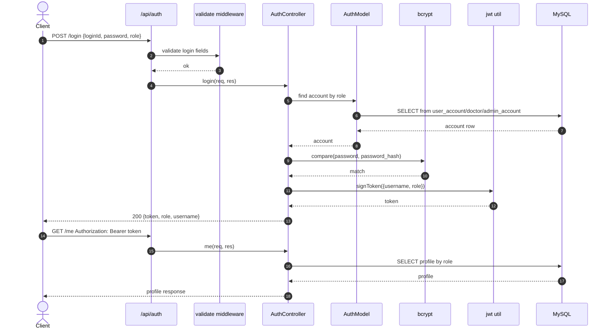

### User Requests A Doctor And Doctor Responds

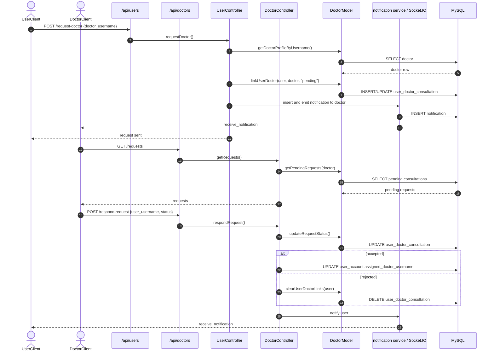

### Doctor Creates Meal Plan

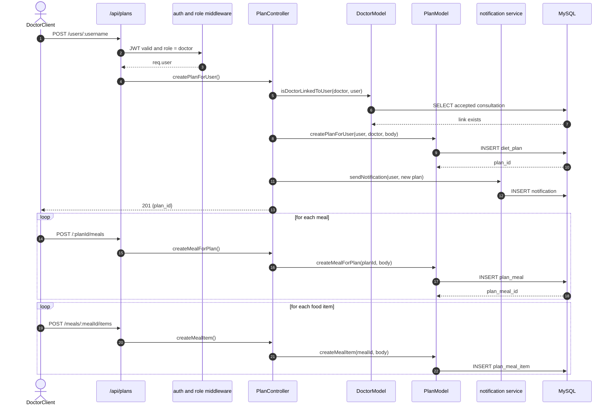

### AI Agent Creates Or Modifies Plans

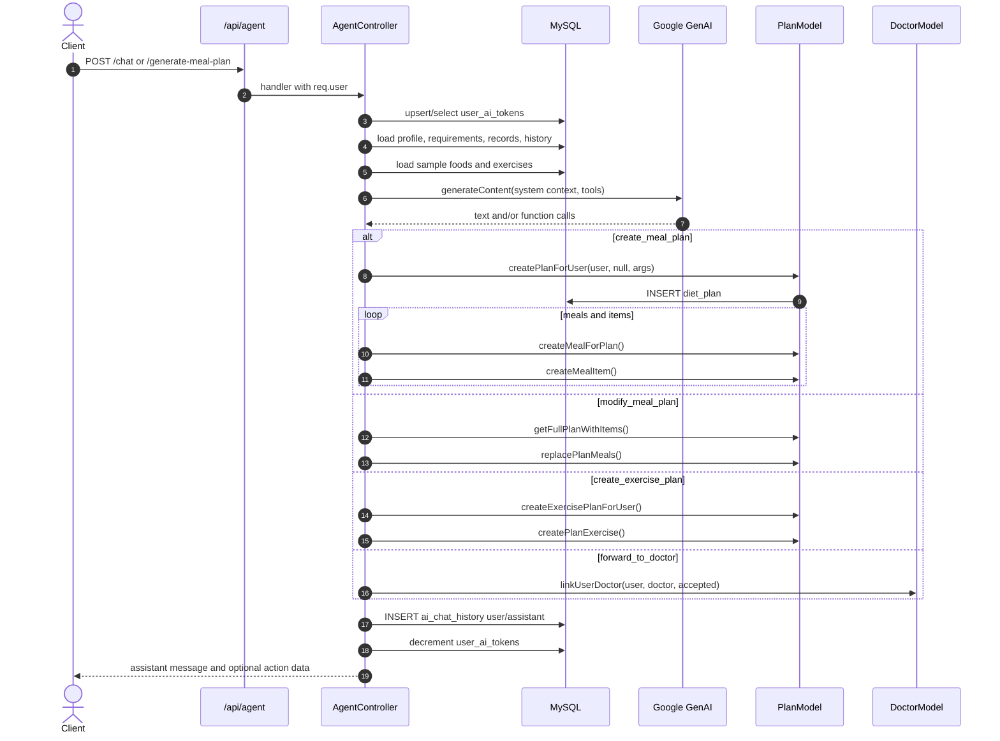

### Real-Time Doctor Patient Messaging

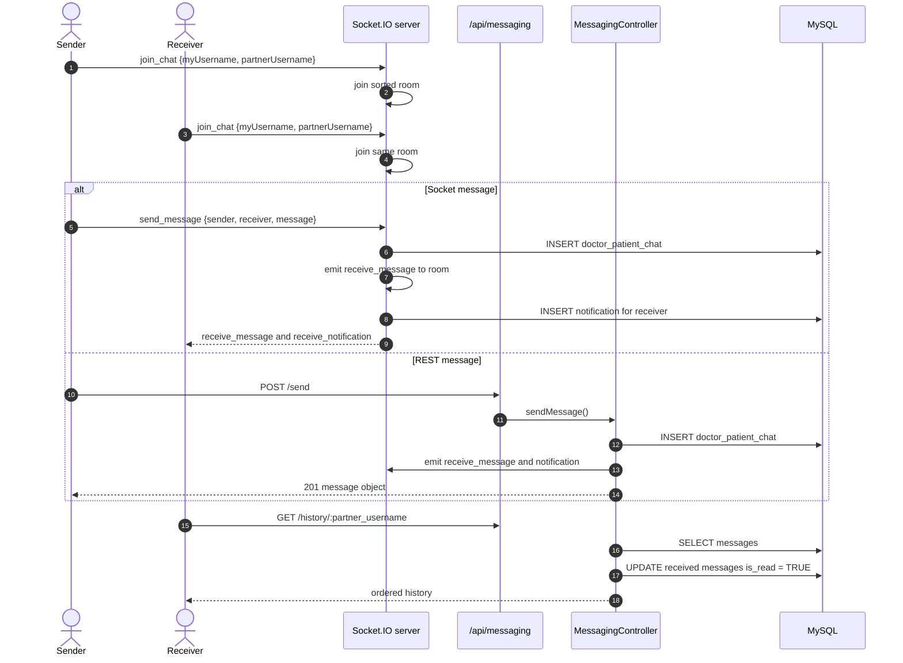

## Flowcharts

### Backend Request Flow

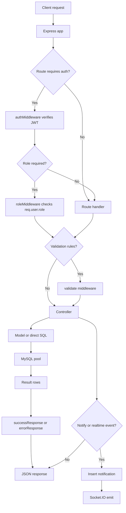

### Subscription And Doctor Assignment Flow

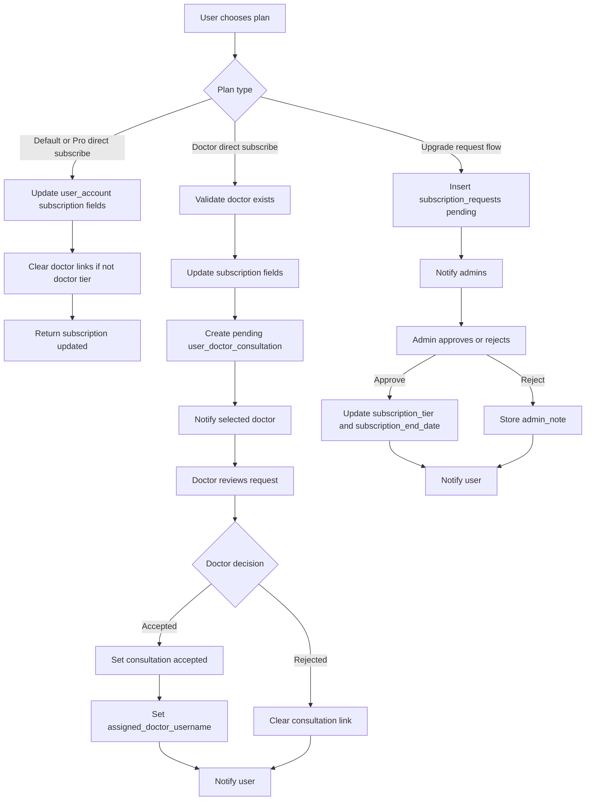

### AI Agent Flow

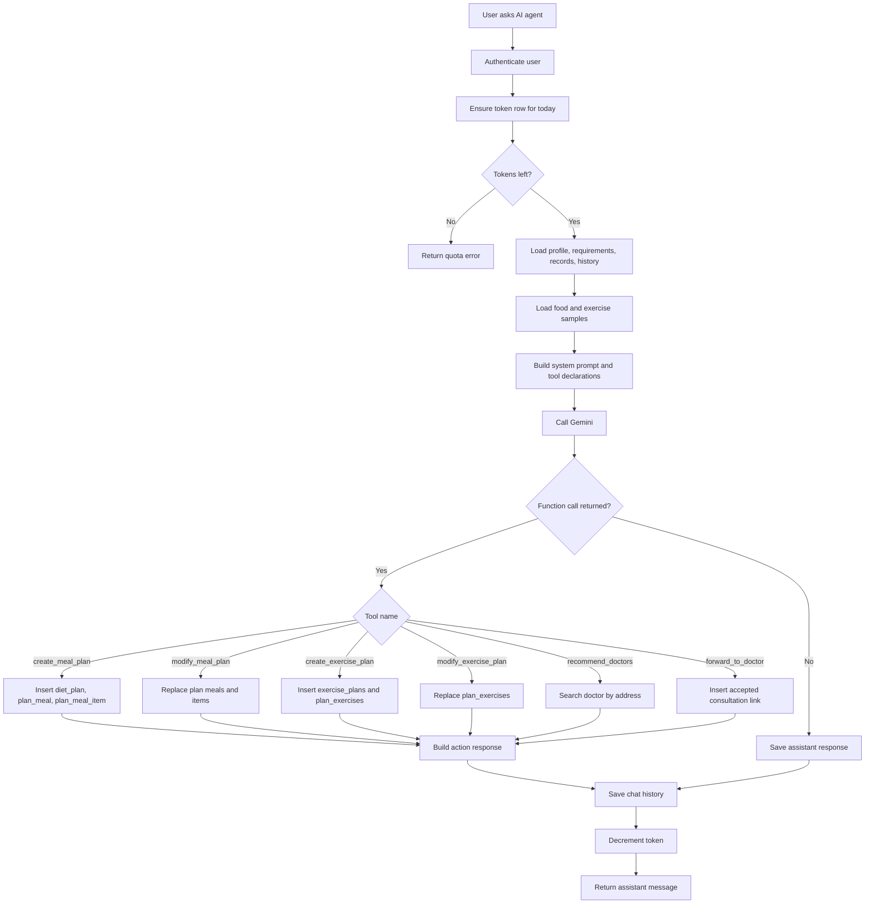

### Daily Tracking And Dashboard Flow

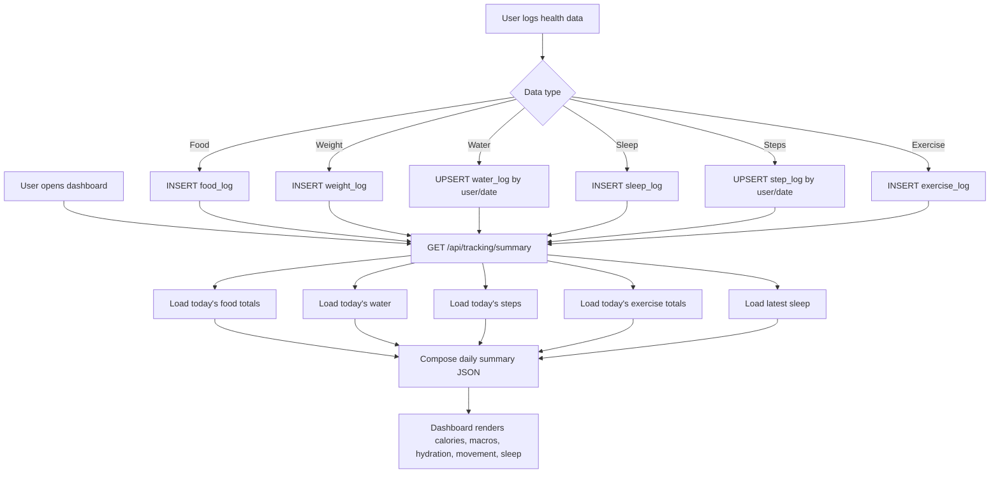

